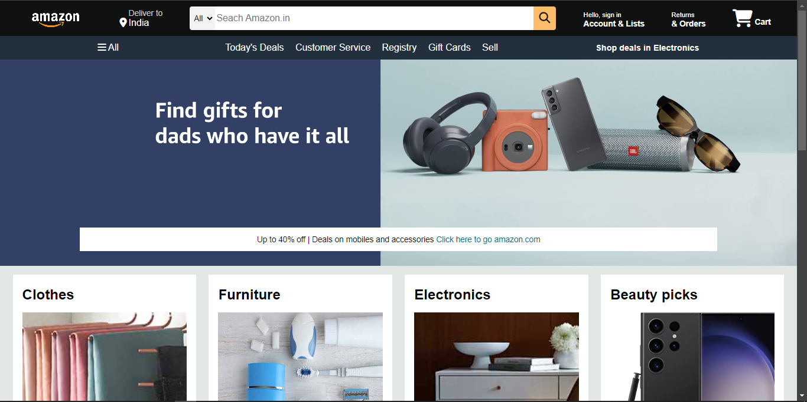
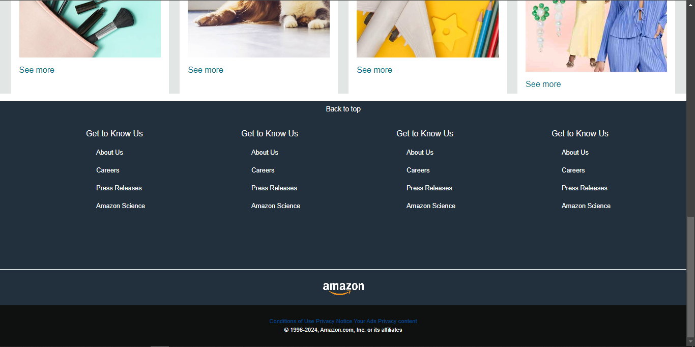

# Amazon Clone

This project is a simple clone of the Amazon website, built with HTML and CSS. It demonstrates the basic layout and styling of Amazon's main page, including the navigation bar, hero section, and product showcase.

## Features

- Responsive navigation bar with search functionality
- Hero section with promotional content
- Product showcase section with images and descriptions
- Basic styling to mimic Amazon's website

## Installation

To get started with this project, follow these steps:

1. **Clone the repository**:
    ```bash
    git clone https://github.com/your-username/amazon-clone.git
    ```

2. **Navigate to the project directory**:
    ```bash
    cd amazon-clone
    ```

3. **Open the `index.html` file in your browser**:
    ```bash
    open index.html
    ```

## Usage

This project is a static HTML and CSS project. Simply open the `index.html` file in your web browser to view the Amazon clone.

## Screenshots







## Contributing

If you would like to contribute to this project, feel free to submit a pull request. Please make sure to follow the coding style and include appropriate documentation.

## License

This project is open-source and available under the MIT License.
